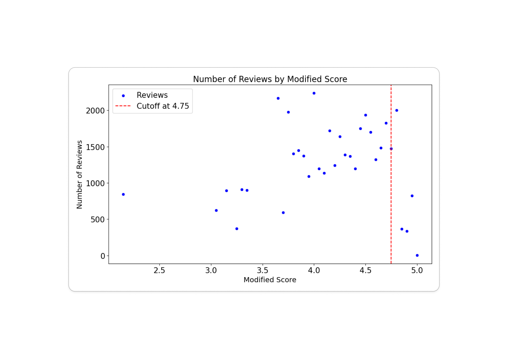

# TripadvisorA_RDD_Analysis
RDD Analysis for Tripadvisor Bubble Rating

Blog Article: [🔗Link](https://ethhong.github.io/statistics/datascience/machinelearning/2025/06/15/RDD-Analysis-Research-on-Tripadvisor-Bubble-Rating.html)

# Summary

***Does bubble rating has positive causal inpact on increasing views of postings for hotels in Tripadvisor? Is it actually beneficial to the business?***

## Background

* Many of platform services, including Tripadvisor utilize 'Bubble Rating' system, in which represent numerical rating into '5 Stars' (or bubble) scale. 
* Since bubble rating system represent scores in unit of 0.5 bubble (e.g. 0.5 stars, or 1 complete stars) most of the services **rounds up** actual numerical ratings into closest 0.5 unit.

## Questions

* However, in some perspective bubble rating could sometimes seen as distorting actual data, and could be deceptive to the customers. It **may boost up** views of postings which are rounded up, but it might harm performance of postings in which their socres are rounded down. 
* Also, in terms of business operations, it is very important to quantitatively measure size and direction of impact caused by bubble rating policy.

# Framework

Regression Discontinuity Design is a methodology to measure causal effect of treatment over the cutoff of the 'running variable'. Without treatment, we assume that dependent variable (e.g. views, or clicks) should have steady or continuous patterns over running variable - for our case, views increase continuously over the rating. However, if the treatment intervenes in certain cutoff, or threshold, it will change the amount of effect (treatment effect - the 'lift'), and 'sensitivity' of running variable's impact on dependent varuable, which is  $\frac{dy}{dx}$. This could be formulated as: 
$$
y = \beta_0 + \beta_1 \cdot \text{Treatment} + \beta_2 \cdot (x-c) + \beta_3 \cdot \text{Treatment} \cdot (x - c) + \epsilon
$$
Where $c$ is cutoff. From the example RDD plot below, we could measure the following with the coefficients from the regression above:

|         | Measure           | Interpretation                                               |
| ------- | ----------------- | ------------------------------------------------------------ |
| \beta_R | \beta_2 + \beta_3 | Slope after treatment: sensitivity of views on rating after treatment. |
| \beta_L | \beta_2           | Slope before treatment: sensitivity of views on rating before treatment. s |
| \tau    | \beta_1           | Treatment effect on the cutoff                               |

# Results and conclusion

We could get following conclusion through running RDD analysis. 

|                  | Cutoff 3.75          | Cutoff 4.25           | Cutoff 4.75                   |
| ---------------- | -------------------- | --------------------- | ----------------------------- |
| Treatment effect | High and Positive    | Not significant       | High and Positive             |
| Slope change     | Positively Increased | No significant change | Turned negative from positive |

From cutoff 3.75, through rounding up scores to 4.0 we could see significant jump on views. Also, we could observe before score 3.75 slope was flat, but it became highly positive after the cutoff. **This implies 4.0+ is the range of rating that people begins to perceive score to be high, and important.** At the same time, score between range of 3.5~3.75 is being rounded down to 3.5. Customers perceive score 3.5 or lower to be low, probably impy low quality. Therefore undre score 3.5, hotels are less likely to get more views even rating increases. 

From cutoff 4.25, roundup effect seems to be insignificant. Both slope change, and treatment effect was measured to be minimal. **This implies from 4.0~4.5, in terms of customer perspective hotels are less differentiated by rating.**  4.0, or 4.2 are treated almost equally good as 4.4, or 4.5. 

After cutoff 4.75, we could see positive treatment effect, but interestingly slope turned negative. This implies in high-rating range, people are more less likely to view hotels if rating is high.

# Sensitivity on 'rating counts' - Interaction term regression. 

 Since the results on high rating range is counterintuitive, we made an hypothesis that this could be an omitted variable which effect on the views - rating count. When we usually see very high rating with little number of reviews, we tend to doubt the credibility of the rating. 

Therefore, we made an hypothesis that number of reviews are working as an proxy for 'credibility', and credibility effects on the views. Also, since we spotted negative relationship between rating and views only in higher rating range, ***we assumed impact of 'review count' on views increases as rating increase***. Therefore, we went throug regression by adding interaction term between rating and number of reviews:
$$
\text{Views} = \beta_0 + \beta_1 \cdot \text{Rating} + \beta_2 \cdot \text{Review Count}  + \beta_3 \cdot \text{Rating} \cdot \text{Review Count} + \epsilon
$$
Here, if we see positive coefficient ($\beta_3$), this means impact of review count actually increases as rating increase. 

As a result, we observed $\beta_3 = 0.0483$. This implies impact difference of review count when rating is 5, is  **66.7%** higher compared to when rating is 3. (When rating is 3, 1 additional review may increase 0.1314 views, while it will increase 0.219 views when rating is 5.)

By observing data, we could observe number of ratings dropped significantly after rating 4.75. 
