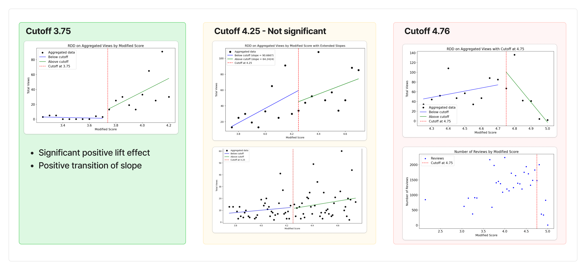

# TripadvisorA_RDD_Analysis
RDD Analysis for Tripadvisor Bubble Rating

# Summary

***Does bubble rating has positive causal inpact on increasing views of postings for hotels in Tripadvisor? Is it actually beneficial to the business?***

## Background

* Many of platform services, including Tripadvisor utilize 'Bubble Rating' system, in which represent numerical rating into '5 Stars' (or bubble) scale. 
* Since bubble rating system represent scores in unit of 0.5 bubble (e.g. 0.5 stars, or 1 complete stars) most of the services **rounds up** actual numerical ratings into closest 0.5 unit.

## Questions

* However, in some perspective bubble rating could sometimes seen as distorting actual data, and could be deceptive to the customers. It **may boost up** views of postings which are rounded up, but it might harm performance of postings in which their socres are rounded down. 
* Also, in terms of business operations, it is very important to quantitatively measure size and direction of impact caused by bubble rating policy.

## Analaysis summary

* **Custoff 3.75**: Significant positive effect on lifting views (clicks) & Positive transition of slope
  * Implying customer are more sensitively responding to the rating after the cutoff
  * Customers **perceive score difference before and after 3.75 to be significant.** 
* **Cutoff 4.25:** Both positive effect & slope change was not significant
  * Customers **does not perceive score differences around 4.25 to be significant.** 
* **Cutoff 4.75**: Positive effect on lifting view. However, after cutoff increase in rating cause drop in clicks (views), ***which is couterintuitive.***
  * Through further analysis, we figured out the trop is due to externality, which is drop in number of reviews. 
  * This imply people are likley to doubt credibility of rating, if rating is very high while number of rating is very low. (e.g. 4.9 or 5.0 rating with only 10 reviews)

